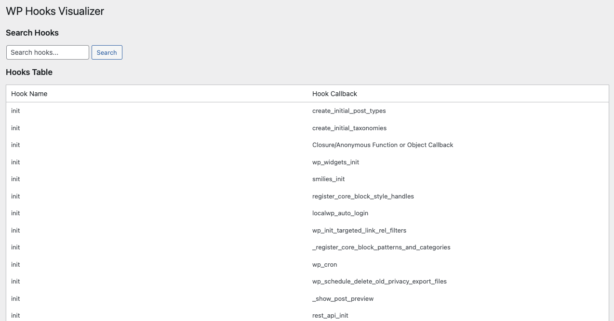

# WP Hooks Visualizer

**WP Hooks Visualizer** is a WordPress plugin that allows users to visualize all registered hooks (both actions and filters) in their WordPress installation. This plugin provides a straightforward way to search and view hooks **without** the ability to modify them. 

## Features

- **Visualize Hooks**: The plugin lists all registered hooks in WordPress, including both actions and filters.
- **Search Functionality**: Easily search for specific hooks by name to quickly find what you're looking for.

## Installation

1. Download the plugin zip file.
2. Go to your WordPress admin dashboard.
3. Navigate to **Plugins > Add New**.
4. Click on the **Upload Plugin** button and choose the downloaded zip file.
5. Click **Install Now** and then **Activate** the plugin.

## Usage

- Once activated, you can access the WP Hooks Visualizer from the **Settings** menu in the WordPress admin dashboard.
- The main page displays a list of all hooks, including their names and callbacks.
- Use the search bar to filter the hooks by name.

## License

This plugin is licensed under the [GPLv2](https://www.gnu.org/licenses/old-licenses/gpl-2.0.en.html) license.
